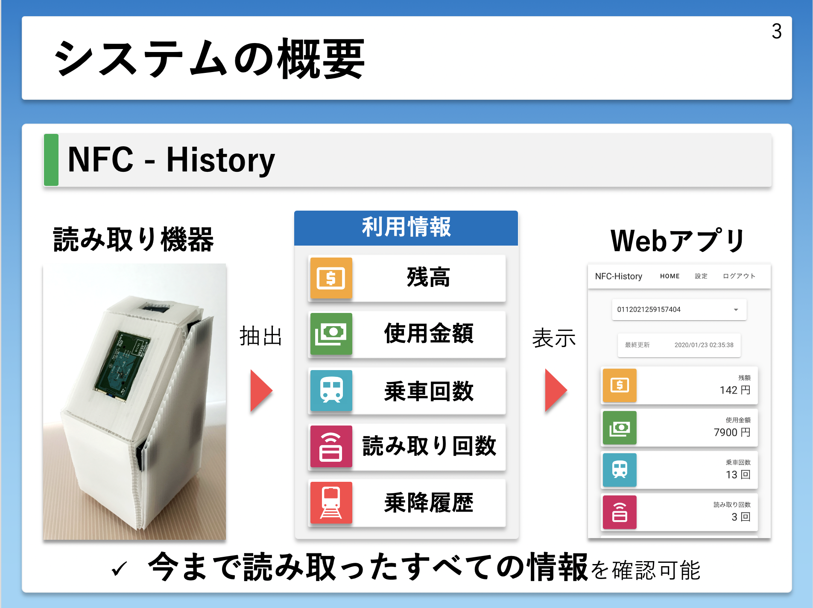
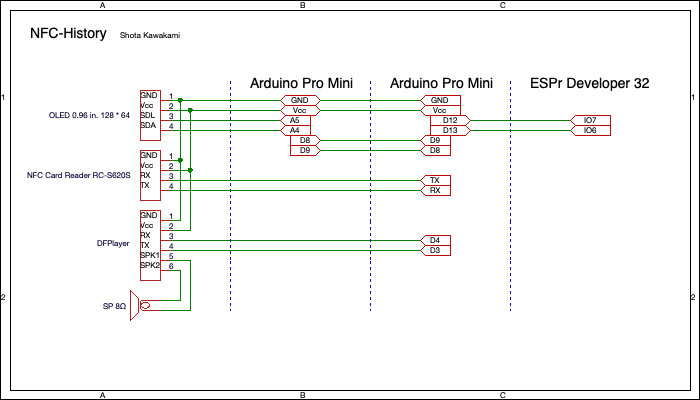

# NFC-History

## これは

岐阜高専 電気情報工学科 3年 電気情報工学実験のマイコン製作実習で作成した作品。

NFC Card Writer Reader RC-S620Sで交通系ICカード(Suica, icoca, toica等)の乗降履歴データを読み取り，Webアプリで確認することができる。

## システム構成

こんな感じ。

## 開発環境

### 読み取り機器

#### 実行環境

- Arduino Pro mini,
- ESPr Developer 32

#### 開発言語, フレームワーク

- Arduino
- C++

### サーバー

#### 実行環境

- Heroku

#### 開発言語, フレームワーク

- Python3.7.x
- Flask

### Webアプリ

#### 開発言語, フレームワーク

- JavaScript
- Vue.js

### サーバー

#### 実行環境

- Firebase RDB

## フォルダ構成

### Arduino/Arduino

Arduino Pro mini用のプログラム

### Arduino/OLED

OLED制御用のArduino Pro mini用のプログラム

### ESP

ESPr Developer 32用プログラム

### Server

Herokuで稼働させるプログラム

### WebApp

Webアプリ用のプログラム

## 回路図

筆者は回路図をほとんど書いたことがないのでわかりにくいですがごめんなさい。

